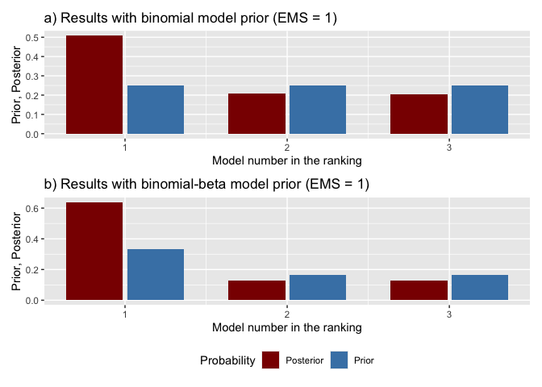
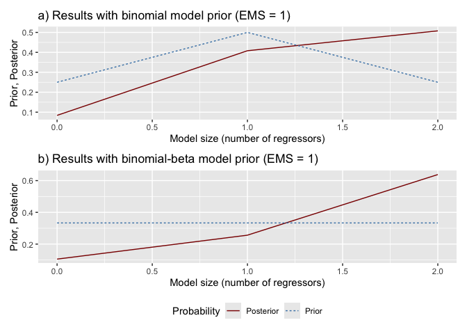

badp: Bayesian Averaging for Dynamic Panels
================

<!-- README.md is generated from README.Rmd. Please edit that file -->

# badp: Bayesian Averaging for Dynamic Panels 

[](https://CRAN.R-project.org/package=badp)
[](https://cran.r-project.org/web/licenses/MIT)
[](https://github.com/badp-project/badp/actions/workflows/R-CMD-check-main.yaml)

## Overview

The **badp** package implements Bayesian model averaging (BMA) for
dynamic panels with weakly exogenous regressors, following the
methodology of [Moral-Benito (2016)](#references). This addresses both:

1.  **Model uncertainty** (selecting among many candidate regressors),
2.  **Reverse causality** (weak exogeneity, which permits current values
    of regressors to correlate with past shocks and other regressors).

The package features:

- Tools to **estimate** the entire model space (via maximum likelihood)
  and calculate **Bayesian information criterion (BIC)** for each
  variant.
- Flexible **model priors** (binomial, binomial-beta, optional dilution
  prior).
- A selectable **learning rate** for the model weights (`weighting` and
  `eta` in `bma()`), so the sensitivity of a conclusion to the marginal
  likelihood approximation can be checked without re-estimating the
  model space.
- Comprehensive **BMA statistics**, including posterior inclusion
  probabilities (PIPs), posterior means, and posterior standard
  deviations (regular or robust).
- Functions to **visualize** prior and posterior model probabilities.
- **Jointness measures** for pairs of regressors, indicating whether
  they are complements or substitutes.
- Support for **parallel computing** to handle large model spaces.

## Installation

You can install the released version of badp from
[CRAN](https://CRAN.R-project.org) with:

``` r
install.packages("badp")
```

And the development version from [GitHub](https://github.com/) with:

``` r
# install.packages("devtools")
devtools::install_github("badp-project/badp")
```

Once installed, simply load the package:

``` r
library(badp)
```

## Getting Started

### Data Preparation

Your data should be in the following format:

1.  A **time** column (e.g., `year`),
2.  An **entity** column (e.g., `country`),
3.  A **dependent variable** column (the variable of interest,
    e.g. `gdp`),
4.  Remaining columns as potential **regressors**.

A convenience function `join_lagged_col()` can help transform a dataset
that already contains both a variable and its lagged version into the
required format.

You can also use `feature_standardization()` to perform mean-centering,
demeaning (entity/time effects), or scaling (standardization) as needed.
For example:

``` r
library(magrittr)

set.seed(20)

# Features are scaled and demeaned,
# then centralized around the mean within cross-sections (fixed time effects)
data_prepared <- badp::economic_growth[, 1:5] %>%
  badp::feature_standardization(
    excluded_cols = c(country, year, gdp)
  ) %>%
  badp::feature_standardization(
    group_by_col  = year,
    excluded_cols = country,
    scale         = FALSE
  )
```

### Estimating the Model Space

The function `optim_model_space()` estimates all possible models (each
possible subset of regressors) via maximum likelihood, returning an
object of class `badp_model_space`.

**Note:** with strongly correlated regressors, both the estimation and
the subsequent statistics step may emit warnings (e.g. `NaNs produced`,
or a message that some models did not converge). The exact reason is
non-trivial: it is typically connected to degenerate behavior of the
likelihood function for some of the models, and understanding it for a
particular dataset requires inspecting the data (e.g. correlations
between regressors), the behavior of the likelihood, and the per-model
per-model diagnostics returned by `convergence()`. A good starting point
is to check which models are affected and how much posterior model
probability they carry - if it is negligible, the warnings can usually
be treated as expected behavior.

For small to moderately sized datasets:

``` r
model_space <- badp::optim_model_space(
  df             = data_prepared,
  dep_var_col    = gdp,
  timestamp_col  = year,
  entity_col     = country,
  init_value     = function(n) runif(n, -10, 10)
)
```

For larger datasets, you can leverage multiple cores:

``` r
library(parallel)

# Choose an appropriate number of cores, taking into account system-level limits
cores <- as.integer(Sys.getenv("_R_CHECK_LIMIT_CORES_", unset = NA))
if (is.na(cores)) {
  cores <- detectCores()
} else {
  cores <- min(cores, detectCores())
}
cl <- makeCluster(cores)

model_space <- badp::optim_model_space(
  df             = data_prepared,
  timestamp_col  = year,
  entity_col     = country,
  dep_var_col    = gdp,
  init_value     = function(n) runif(n, -10, 10),
  cl             = cl
)

stopCluster(cl)
```

A progress bar is displayed to easily track the ongoing computation.

### Performing Bayesian Model Averaging

After preparing the model space, run `bma()` to obtain posterior model
probabilities, posterior inclusion probabilities (PIPs), and other BMA
statistics under the **binomial** and **binomial-beta** model priors:

``` r
bma_results <- badp::bma(model_space, round = 3)

# BMA statistics under each model prior
badp::bma_table(bma_results)
#>           PIP     PM   PSD  PSDR  PMcon PSDcon PSDRcon %(+)
#> gdp_lag    NA  1.078 0.110 0.227  1.078  0.110   0.227  100
#> ish     0.710  0.085 0.061 0.090  0.120  0.032   0.085  100
#> sed     0.714 -0.046 0.061 0.111 -0.065  0.064   0.127    0
badp::bma_table(bma_results, prior = "beta")
#>           PIP     PM   PSD  PSDR  PMcon PSDcon PSDRcon %(+)
#> gdp_lag    NA  1.078 0.109 0.238  1.078  0.109   0.238  100
#> ish     0.765  0.091 0.058 0.090  0.119  0.033   0.085  100
#> sed     0.768 -0.048 0.062 0.114 -0.063  0.064   0.126    0

# Posterior inclusion probabilities on their own
sort(badp::pip(bma_results), decreasing = TRUE)
#>   sed   ish 
#> 0.714 0.710

# Prior and posterior model sizes
badp::model_size_table(bma_results)
#>               Prior model size Posterior model size
#> Binomial                     1                1.424
#> Binomial-beta                1                1.533
```

Key columns in the BMA output include: - **PIP**: Posterior inclusion
probability for each regressor. - **PM**: Posterior mean of each
parameter (averaged over all models). - **PSD/PSDR**: Posterior standard
deviations (regular/robust) of each parameter - **%(+)**: Percentage of
models (among those that include a given regressor) in which the
parameter estimate is positive.

### Visualizing Prior and Posterior Probabilities

1.  **`model_pmp()`**: Shows prior vs. posterior model probabilities,
    ranking models from best to worst.
2.  **`model_sizes()`**: Displays how prior vs. posterior probabilities
    mass is distributed across different model sizes.

``` r
# Prior vs. posterior model probabilities, three best models.
# `type = "histogram"` draws bars, which read well for a handful of models;
# the default `"line"` is better once there are many.
badp::model_pmp(bma_results, top = 3, type = "histogram")
```



``` r

# Probabilities by model size
badp::model_sizes(bma_results)
```



### Selecting the Best Models

Use `best_models()` to extract specific information about the top-ranked
models:

``` r
# Retrieve the 5 best models according to binomial prior
top3_binom <- badp::best_models(bma_results, prior = "binomial", best = 3)

# Which regressors enter each of the three models
top3_binom
#> Best 3 of 4 models, ranked by the binomial posterior model probability
#> 
#>         No. 1 No. 2 No. 3
#> gdp_lag x     x     x    
#> ish     x     .     x    
#> sed     x     x     .    
#> PMP     0.508 0.206 0.202
#> 
#> 'x' marks an included regressor. Use summary() for the estimates,
#> plot() for the same tables as a graphic, and [[i]] for one model.

# Estimates for all three, with robust standard errors
summary(top3_binom, robust = TRUE)
#> Best Models Summary
#> ===================
#> 
#> Models shown:            3 of 4
#> Ranking model prior:     binomial
#> Posterior mass covered:  0.916
#> Regressors per model:    2, 1, 1
#> 
#> Estimates (robust standard errors in parentheses):
#>         No. 1            No. 2            No. 3           
#> gdp_lag 1.079 (0.273)*** 1.126 (0.151)*** 1.027 (0.191)***
#> ish     0.119 (0.086)                     0.121 (0.082)   
#> sed     -0.06 (0.126)    -0.077 (0.127)                   
#> PMP     0.508            0.206            0.202           
#> 
#> Signif. codes: 0.01 '***'  0.05 '**'  0.1 '*'

# A single model on its own
top3_binom[[1]]
#> Model No. 1 of the binomial ranking
#> Posterior model probability: 0.508
#> Regressors included: ish, sed
#> 
#>         Estimate Std. Error Pr(>|z|)    
#> gdp_lag    1.079      0.111    0.000 ***
#> ish        0.119      0.033    0.000 ***
#> sed       -0.060      0.063    0.342    
#> 
#> Standard errors: conventional. Wald p-values, standard normal reference.
#> Signif. codes: 0.01 '***'  0.05 '**'  0.1 '*'
```

### Jointness Measures

Assess whether two regressors tend to co-occur (complements) or exclude
each other (substitutes) using `jointness()`. By default, it calculates
the Hofmarcher et al. (2018) measure:

``` r
joint_measures <- badp::jointness(bma_results)
head(joint_measures)
#>       ish   sed
#> ish    NA 0.159
#> sed 0.505    NA
```

You can also specify older measures, such as `"LS"` (Ley & Steel) or
`"DW"` (Doppelhofer & Weeks):

``` r
joint_measures_ls <- badp::jointness(bma_results, measure = "LS")
```

## Example

Below is a minimal reproducible workflow:

``` r
# 1) Data preparation
data_prepared <- badp::economic_growth[, 1:5] %>%
  badp::feature_standardization(
    excluded_cols = c(country, year, gdp)
  ) %>%
  badp::feature_standardization(
    group_by_col  = year,
    excluded_cols = country,
    scale         = FALSE
  )

# 2) Estimate model space
model_space <- badp::optim_model_space(
  df            = data_prepared,
  dep_var_col   = gdp,
  timestamp_col = year,
  entity_col    = country,
  init_value    = function(n) rep(0.5, n),
)

# 3) Run Bayesian Model Averaging
bma_obj <- badp::bma(
  model_space = model_space
)

# 4) Inspect the top 3 models under binomial prior
best_3 <- badp::best_models(
  x = bma_obj,
  prior = "binomial",
  best = 3
)
best_3                      # inclusion table for the three models
#> Best 3 of 4 models, ranked by the binomial posterior model probability
#> 
#>         No. 1 No. 2 No. 3
#> gdp_lag x     x     x    
#> ish     x     .     x    
#> sed     x     x     .    
#> PMP     0.508 0.206 0.202
#> 
#> 'x' marks an included regressor. Use summary() for the estimates,
#> plot() for the same tables as a graphic, and [[i]] for one model.
coef(best_3[[1]], se = TRUE)  # estimates for the best one
#>            Estimate Std. Error Robust Std. Error     Pr(>|z|) Robust Pr(>|z|)
#> gdp_lag  1.07934984 0.11099769        0.27305145 2.380587e-22    7.720409e-05
#> ish      0.11929274 0.03293347        0.08553459 2.920699e-04    1.631146e-01
#> sed     -0.06010157 0.06326577        0.12591614 3.421196e-01    6.331384e-01
```

## Troubleshooting

1.  Cannot install required packages / setup renv environment

Make sure to go through the displayed errors. The problem might be
connected to your OS environment. E.g. you might see an information like
the following:

    Configuration failed to find one of freetype2 libpng libtiff-4 libjpeg. Try installing:
     * deb: libfreetype6-dev libpng-dev libtiff5-dev libjpeg-dev (Debian, Ubuntu, etc)
     * rpm: freetype-devel libpng-devel libtiff-devel libjpeg-devel (Fedora, CentOS, RHEL)
     * csw: libfreetype_dev libpng16_dev libtiff_dev libjpeg_dev (Solaris)

In such case you should first try installing the recommended packages.
With properly configured system environment everything should work fine.

## References

<div id="references">

</div>

- Moral-Benito, E. (2016). “Growth Empirics in Panel Data Under Model
  Uncertainty and Weak Exogeneity.” *Journal of Applied Econometrics*.
- Ley, E. and Steel, M. F. J. (2007). “Jointness in Bayesian Variable
  Selection with Applications to Growth Regression.” *Journal of
  Macroeconomics*.
- Doppelhofer, G. and Weeks, M. (2009). “Jointness of Growth
  Determinants.” *Journal of Applied Econometrics*.
- Hofmarcher, P., Crespo Cuaresma, J., Grün, B., Humer, S., and
  Moser, M. (2018). “Bivariate jointness measures in Bayesian Model
  Averaging: Solving the conundrum.” *Journal of Macroeconomics*.

(Additional references related to the methodology can be found in the
package vignette.)

## Contributions and Issues

We welcome bug reports, feature requests, and contributions. Feel free
to open an issue or pull request on
[GitHub](https://github.com/badp-project/badp).

## License

This package is distributed under the MIT license. See the
[LICENSE](LICENSE) file for details.

------------------------------------------------------------------------
